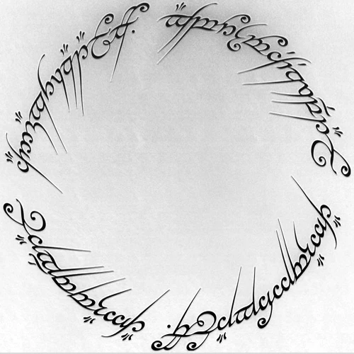

# one_ring Segmentation


 


```one_ring``` is a light, moduler,configurable segmentation wrapper package for training,deployment and inference part of ML Life Cycle. Also it can be a template module for any Computer Vision project to use in production. It is designed to be modular and reproducible. It is a good choice for experiment tracking and development.

## Requirements
This module uses Python version 3.10.12 and TensorFlow version 2.8.1. In order to get most out of one_ring, it is recommended to use these versions.

## How to Build
In order to start building your segmentation projects with one_ring you need first to build it in your environment. Following these steps you can build easily. Don't worry, it will take only a few minutes before you start delving into details of the tool.

``` bash
git clone https://github.com/omrylcn/one_ring.git
cd one_ring
conda create -n one_ring python=3.10
conda activate one_ring
pip3 install -r requirement.txt
```

Now that you installed all the necessary libraries, you can start by importing the submodules of one_ring necessary to build your first project instantly.

``` python
from one_ring.config import get_config
from one_ring.data import get_data_loader
from one_ring.model import get_model_builder
```

## Submodules, Functions and Methods


## Version History
------------------
 If applicable, include a version history to document the changes made in each version of the tool.

 ## License Information
 ----------------------

 ## References
 -------------
