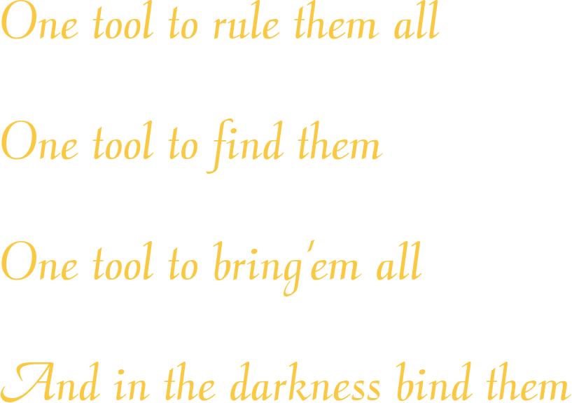

# one_ring Segmentation

 

`one_ring` is a lightweight, modular, and configurable segmentation wrapper package for the entire ML lifecycle, including training, deployment, and inference. It serves as an excellent template for production-ready Computer Vision projects, emphasizing modularity and reproducibility. `one_ring` is designed to facilitate experiment tracking and streamline development processes.

## Example Output

Here's an example of the segmentation results you can achieve with `one_ring`:


The image shows:
- Left: The target (ground truth) segmentation
- Middle: The predicted segmentation
- Right: The original image with the predicted segmentation overlay


## Requirements
This module uses Python version 3.10.6 and TensorFlow version 2.15.0. In order to get most out of one_ring, it is recommended to use these versions.

## How to Build
In order to start building your segmentation projects with one_ring you need first to build it in your environment. Following these steps you can build easily. Don't worry, it will take only a few minutes before you start delving into details of the tool.

``` bash
git clone https://github.com/omrylcn/one_ring.git
cd one_ring
conda create -n one_ring python=3.10.6
conda activate one_ring
pip3 install -r requirement.txt
```

Also you can directly install 'one_ring' with pip:

``` bash
pip3 install git+https://github.com/omrylcn/one_ring.git

```

Once you installed the library, you can check the installation via importing one_ring:

``` python
import one_ring
print(one_ring.__version__)

```

## Quick Start

Here's how to get started with `one_ring`:

```python
import warnings
import numpy as np
import matplotlib.pyplot as plt
import albumentations as A
import tensorflow as tf
from tensorflow.keras.metrics import Recall, Precision

import one_ring
from one_ring.config import get_config
from one_ring.data import get_data_loader
from one_ring.transformers import Transformer
from one_ring.callbacks import ORLearningRateCallback
from one_ring.scheduler import ORLearningRateScheduler
from one_ring.losses import FocalTverskyLoss, DiceLoss, LogCoshDiceLoss, FocalLoss, SymmetricUnifiedFocalLoss, JaccardLoss, BoundaryDoULoss
from one_ring.metrics import DiceScore, JaccardScore
from one_ring.models import DeepLabV3Plus
from one_ring.train import Trainer
from one_ring.utils import generate_overlay_image, calculate_confusion_matrix_and_report

warnings.filterwarnings("always")

print(tf.__version__)
print(one_ring.__version__)

# Load configuration
config = get_config(config_filename="your_config_file")

# Prepare datasets
train_data_loader, val_data_loader = get_data_loader(config.data, train_data=True, val_data=True)

# Set up transformations
tr_transforms = Transformer(config.augmentation, "train")
val_transforms = Transformer(config.augmentation, "val")

# Load data with transformations
train_dataset = train_data_loader.load_data(transform_func=tr_transforms)
val_dataset = val_data_loader.load_data(transform_func=val_transforms)

# Set up model
model = DeepLabV3Plus(**config.model).build_model()

# Set up loss and metrics
loss = BoundaryDoULoss(**config.loss)
metrics = [Recall(), Precision(), DiceScore(), JaccardScore()]

# Set up callbacks
lr_scheduler = ORLearningRateScheduler(**config.lr_scheduler).get()
callbacks = [ORLearningRateCallback(lr_scheduler)]

# Initialize trainer and train
trainer = Trainer(config, model, train_dataset, val_dataset, callbacks=callbacks, metrics=metrics, loss=loss)
history = trainer.fit()

# Evaluate and visualize results
# (Use generate_overlay_image and calculate_confusion_matrix_and_report as needed)

```

## Key Components

- **Config**: `get_config()` loads your configuration file.
- **Data Loading**: `get_data_loader()` provides data loaders for your datasets.
- **Transformations**: `Transformer` applies data augmentations and preprocessing.
- **Models**: Various model architectures like `DeepLabV3Plus` are available.
- **Training**: `Trainer` class handles the training process.
- **Loss Functions**: Multiple loss functions are provided, such as `FocalTverskyLoss`, `DiceLoss`, etc.
- **Metrics**: Custom metrics like `DiceScore` and `JaccardScore` are available.
- **Callbacks**: `ORLearningRateCallback` for learning rate management.
- **Scheduler**: `ORLearningRateScheduler` for learning rate scheduling.
- **Utils**: Utility functions like `generate_overlay_image` and `calculate_confusion_matrix_and_report` for evaluation and visualization.


## Deployment and Inference

For deployment and inference, use the `Inferencer` class:

```python
from one_ring.deploy.inferencer import Inferencer

inferencer_config = {
    "model_type": "onnx",
    "model_path": "path/to/your/model",
    "preprocessor_type": "albumentations",
    "postprocessor_type": "vanilla",
    "device": "cpu",
    "threshold": 0.6
}

inferencer = Inferencer(inferencer_config, cache_size=256, log_level="INFO")
pred_mask, pred_image = inferencer(input_image)
```

## Customization

Extend `one_ring` by:

1. Adding new model architectures to the `models` module.
2. Implementing custom loss functions in the `losses` module.
3. Creating new metrics in the `metrics` module.
4. Developing custom data loaders or transformers as needed.


## Contributing

Contributions to `one_ring` are welcome! Please refer to our contribution guidelines for more information.

## Version History
------------------
 If applicable, include a version history to document the changes made in each version of the tool.

 ## License Information
 ----------------------

 ## References
 -------------